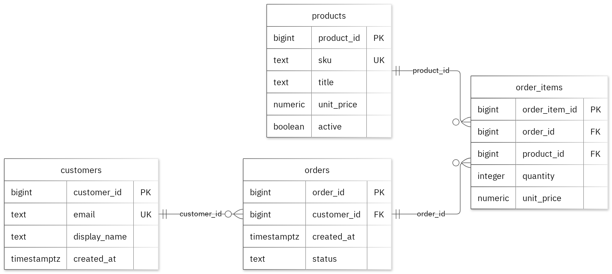
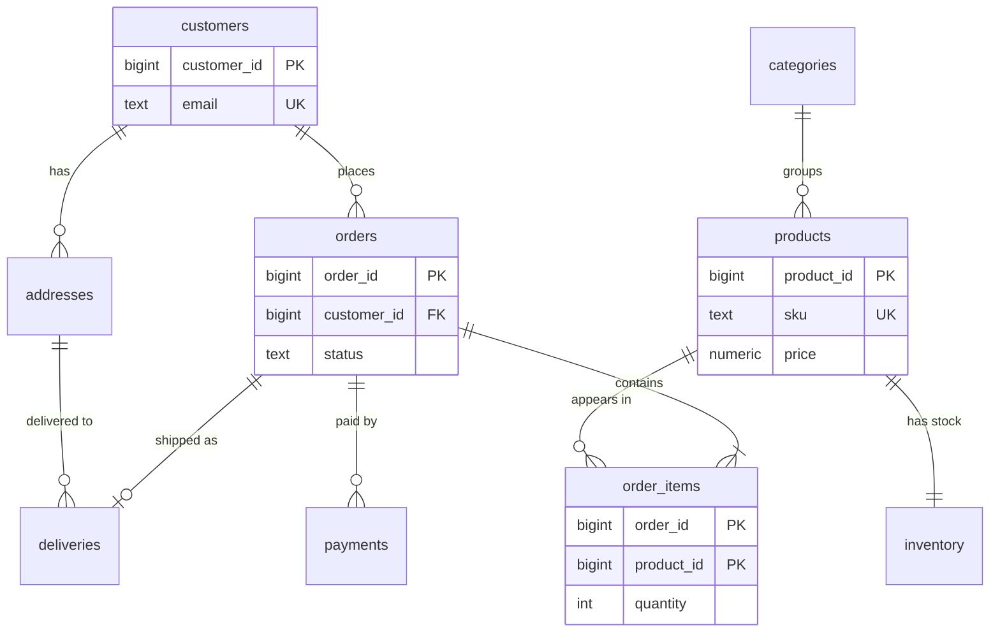

# NaijaMart: ER diagram

```mermaid
erDiagram
    customers ||--o{ addresses : "has"
    customers ||--o{ orders : "places"
    orders ||--|{ order_items : "contains"
    products ||--o{ order_items : "appears in"
    categories ||--o{ products : "groups"
    products ||--|| inventory : "has stock"
    orders ||--o{ payments : "paid by"
    orders ||--o| deliveries : "shipped as"
    addresses ||--o{ deliveries : "delivered to"
    customers { bigint customer_id PK
      text email UK }
    orders { bigint order_id PK
      bigint customer_id FK
      text status }
    order_items { bigint order_id PK
      bigint product_id PK
      int quantity }
    products { bigint product_id PK
      text sku UK
      numeric price }
```

PK: primary key; FK: foreign key; UK: unique. The crow's-foot end means "many", a bar means "exactly one", a circle means "optional".
